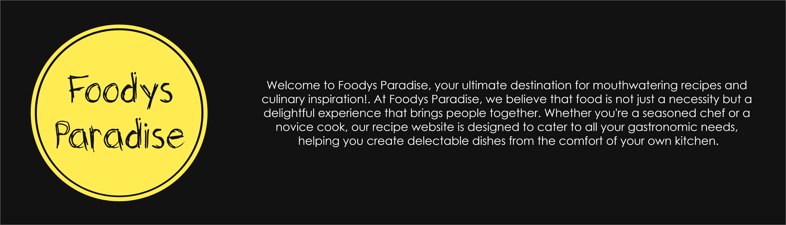

# Foodys Paradise 😋

Welcome to Foodys Paradise, a culinary adventure where you can discover over 5000+ delectable recipes. Unleash the magic of our ingenious feature - effortlessly input fridge items and unleash a flood of personalized recipe recommendations. Elevate your cooking experience now!

## Website 🌐

Visit my website at [Foodys Paradise](https://foodysparadisef.onrender.com).

## Behance Design 💻

Check out the Behance design of our website for a visual overview: [Web Design](https://www.behance.net/gallery/178559595/FoodysParadise).

## Technologies Used 🧑‍💻

This project was developed using the MERN (MongoDB, Express, React, Node.js) stack.

## Contributing 🤝

We welcome contributions from the community! If you'd like to contribute to Foodys Paradise.

## Issues and Bug Reports 🐛

If you encounter any issues or want to report a bug, please open an issue on our [Issue Tracker](https://github.com/yourusername/foodys-paradise/issues).

## Contact 📞

If you have any questions or need further assistance, feel free to contact us at [your@email.com](mailto:your@email.com).

Thank you for visiting Foodys Paradise and happy cooking!
